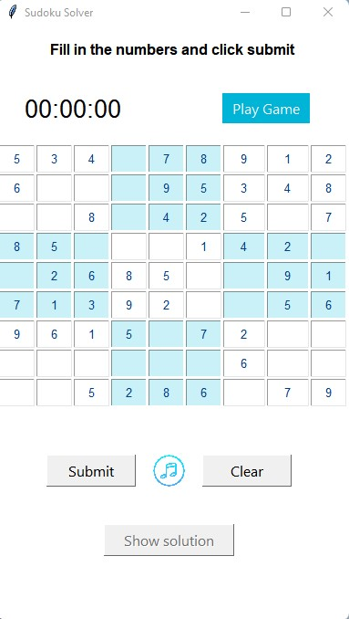
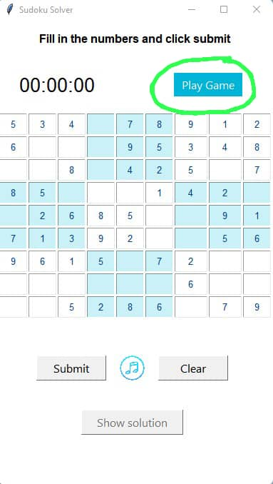
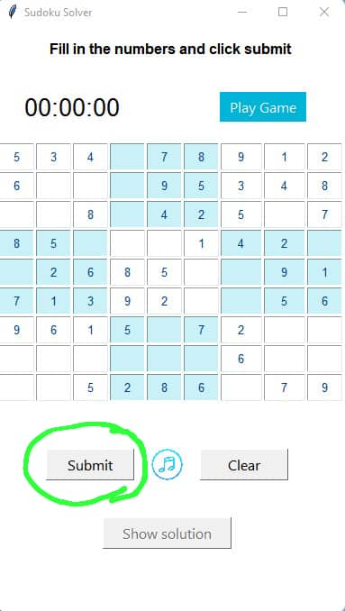
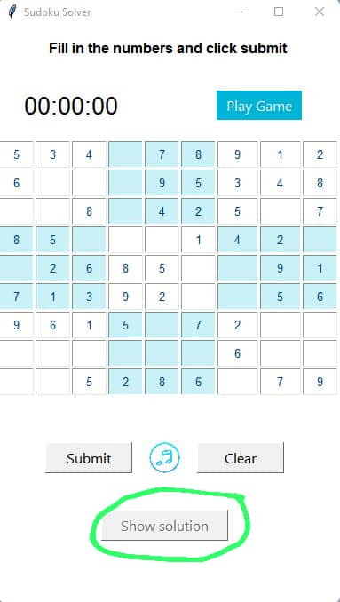
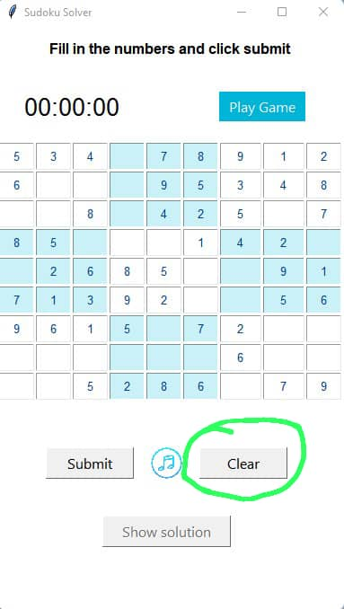
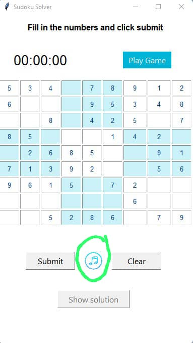

# Final-Jan-April-2022

**_PROJECT DEPENDENCIES:_** \
**_Tkinter:_** Used for implementing the Graphical User Interface (GUI) of the project. \
**_Pygame:_** Used to implement the play and stop music functionality when user is playing the game. \
**_time:_** To analyse the time complexity of the algorithm. \
**_tracemalloc:_** this module allows us to monitor memory allocations in the code. \
**_matplotlib.pyplot:_** a plotting library for creating static, animated, and interactive visualizations for our code. \
**_Graph:_** Used to visualize analyse the space complexity of the algorithm. \
**_timeit:_**  is a method in Python library to measure the execution time our code takes. \
**_unittest:_** library that provides us with a base class, TestCase , which may be used to create new test cases. 

_**HOW TO SET UP OR INSTALL THE CODE:**_ \
Clone the project from to your local machine.
Install project dependencies (eg. pip install pygame if running code on VScode)
Run the gui.py file to get the interactive interface with the sudoku grid

_**HOW TO RUN THE CODE:**_ \
To open the Sudoku GUI, run the gui.py file.
To run the tests, navigate to the tests folder and run the tests.py file.
To run the algorithm, navigate to the algorithmtests folder and run the algorithmtests.py file. 
To view the breakdown of the complexity analysis, navigate to complexityanalysis.txt

_**GAME INSTRUCTIONS:**_ \
Welcome to our Sudoku game. If you are new to a sudoku game, this is a set instructions to give you a fair idea of 
how to go about the game. The buttons described are circled in the attached image for further clarity.
We encourage all players to read this first, as this game could differ slightly in some functionalities from other sudoku games.

This game is made of a 9x9 grid with distinct counting numbers ranging from 1 to 9 in each column, row and 3x3 grid.
Each 3x3 grid is differentiated from its adjacent 3x3 grid by colour. 
The newly opened sudoku puzzle looks like this: 

To start a game, click the **"Play Game"** button. This makes the empty cells in the grid editable.
Edit the empty cells with the right digits such that the rule of the puzzle is obeyed.
Rules of the game: No one number should appear more than once in one particular column, row, or 3x3 grid.
To pause for a different activity, click the **“Pause”** button.
The pause button replaces the "Play Game" button once game is in progress. 

Once you are done, click **“Submit”** button 

If you want to check the correct answers of the  puzzle click **“Show solution”** button. 

If you want to clear your inputs click **“Clear”** button 

To play or stop playing a song, click on **"play music icon"** button or **"Stop music icon"** respectively.
These icons alternate between each other once clicked. Check the image below to know the icon to use. 

You can edit your answers by using the backspace to erase your input. \
Please try to add your answers before you click the **“Show solution”** button because you cannot edit after
The time you take to complete a current try is monitored and compared with that of the previous tries to track progress

_**CONTEXT OF OUR PROBLEM**_

According to data recorded by Alzheimer’s Disease International on associations that cater to dementia patients,
approximately 17 out of 55 countries in Africa have adequate facilities that support people living with dementia.
Of these 17 countries,
the majority of the people living with dementia cannot access the assistance they require from these facilities due to a lack of funds.
Additionally, the scale of stigma in sub-Saharan Africa is tremendous.
This makes it difficult for dementia patients to access the support they need to cope better with the condition in their day-to-day lives,
because there is insufficient/flawed information about the condition,
as well as the strategies on how best to care for patients suffering from the incurable illness.
Consequently, some people result to traditional healers for solutions (Kehoua et al., 2019).
Bearing this in mind, we need to develop cheaper,
medically proven alternatives that are easily accessible to these individuals to mitigate the effects of dementia
and improve their overall daily functioning.

_**SOLUTION**_ 

Our solution is a user-friendly Graphical sudoku game aimed at enabling players to improve and sharpen their cognitive skills. 
We do this by incorporating a system that tracks the time a user takes to correctly complete a sudoku puzzle. 
The system compares the time taken by the user over time (at least 2 rounds)
and gives them a notification of the trend that their cognitive skills are taking 
eg. “you have taken x amount of time less than you’re previous attempt”, 
which helps them gain insight into how their cognitive skills are changing over time.
Unlike conventional sudoku games, we incorporated soothing music into our game,
in a bid to improve our users’ experience, while solving the puzzle. 
Additionally, according to research carried out by Harvard Health, 
we found that listening to music reactivates areas of the brain associated with memory ad reasoning. 
The user has the option to play or pause the music, based on their preference.
The beneficiaries of our application are people who would like to hone their cognitive and logical thinking skills, 
however our main target audience are people suffering from dementia, 
with the aim of improving their overall daily functioning and boosting their attention span.

